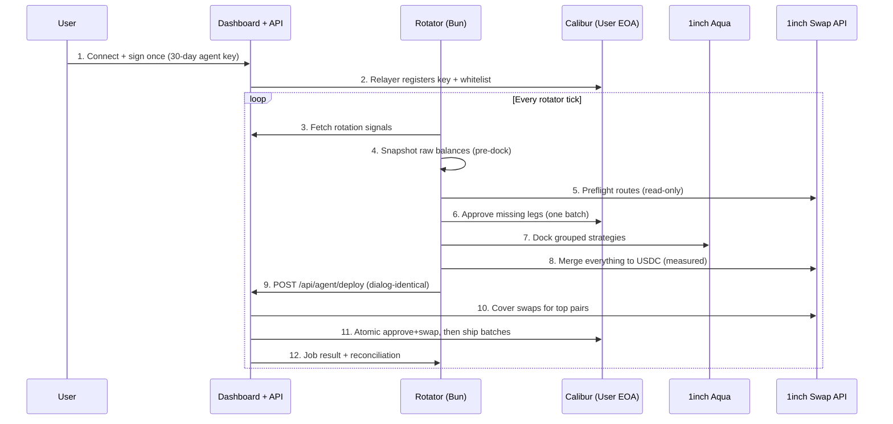

# Aquara

<h3 align="center">Autonomous 1inch Aqua position manager - delegate once, your Aqua strategies never sit idle again.</h3>

---

Aquara is an autonomous liquidity manager built on top of **1inch Aqua** on **Base**. Users delegate to a keeper agent with a single signature; the agent watches their Aqua strategies and **rotates** anything dead, dying, or underperforming - out-of-range bands, drained sides, zero-volume positions - into the current top earners. Decisions are deterministic (on-chain verdicts, trash rules, gain gates); an optional AI advisor adds a second opinion on judgment calls only, and is off unless configured. Execution settles through a **shared 1inch quoter + 1inch swap API** inside **one atomic Calibur batched transaction** per stage, with the relayer paying gas. Aqua is the substrate; the agent is the worker that keeps it productive.

> **One agent. One rule: committed capital should never earn zero.**

> **Use at your own risk.** Aquara is experimental hackathon software running against Base mainnet with real funds. The delegation hook it relies on had a known vulnerability class in the past, and this integration has not been professionally audited. Session keys are scoped and revocable, but review every transaction, start with amounts you can afford to lose, and run dry-run mode first.

---

## What Makes Aquara Special

### Who This Is For

Meet Nadia. She's been LP'ing on 1inch Aqua with $3,000 across two concentrated strategies. The first week was great - then the market moved, one band drifted fully out of range and the other sat in a pair nobody trades. Both positions show the same thing every morning: volume $0.00, fees $0.00.

Nadia knows what she _should_ do: dock both strategies, swap everything into the pair that's actually earning, ship fresh positions. But that means getting quotes right, sequencing approvals, checking allowances, simulating every batch, paying gas on each leg - and doing it again next week when tops rotate. So instead, she just… leaves it. Idle. For weeks.

Her problem isn't a missing button. It's that there's no platform where an autonomous agent _watches her strategies_, _decides with evidence_ which ones are dead, and _executes the full rotation_ - dock, merge, redeploy - without taking custody of her funds.

---

### The Problem

Concentrated liquidity goes stale silently. Once a strategy drifts out of its band - or was deployed into a pair with no flow - it earns nothing while the capital looks "invested". Recovery is a multi-leg operation: read the Citadel of truth (on-chain balances, not cached API numbers), get sane quotes, sequence approvals, dock, swap, ship - each leg with its own gas, its own revert risk, its own stale-data trap.

The existing tooling falls short:

- **Manual rotation** - gas-expensive, timing-sensitive, requires the LP to monitor 24/7 and hand-verify every calldata
- **Custody-based vaults** - user surrenders assets to a vault contract; loses direct ownership and strategy choice
- **Volume bots without judgment** - generate flow but can't tell a dead position from a live one
- **One-shot scripts** - quote once, trust blindly, fail cryptically on the first stale read or mispriced route

And none of them verify _before_ spending gas, reconcile _after_ spending it, or keep working when RPC nodes lag and APIs throttle.

**How might we build a rotation agent that acts only on verified evidence, simulates everything before submitting, measures everything after, and never holds the user's funds?**

---

### The Solution

Aquara solves this with six core primitives:

**1. EIP-7702 Session Keys via Calibur** - One signature registers a 30-day agent key on the user's EOA. No on-chain delegation tx, no gas to set up. The key is scoped by an execution hook that whitelists exactly what the agent may touch: Aqua ship/dock, ERC-20 approvals, and the 1inch router. Revoke anytime.

**2. Evidence-Based Verdicts, Not Vibes** - Every position gets one of six verdicts from live chain reads: `healthy`, `depleted`, `side-depleted`, `oor-suspect` (price outside the shipped band, proven against spot - not guessed from quotes), `thin-allowance`, `inactive` (never filled since deploy). Trash rules (zero volume, low APY, underperforming vs tops, capital-efficiency ratios) and a gain gate sit on top; proven dead capital bypasses both and rotates immediately.

**3. Atomic Calibur Execution Per Stage** - Snapshot → preflight → approve → dock → merge → deploy. Each mutating stage is one batched `execute`: approvals and swaps land together or nothing moves. Every batch is simulated before sending - a revert costs zero gas by construction.

**4. One Shared Quoter** - Web deploy and rotator merge quote through the same function (`web/lib/oneinch-quote.ts`): same pacing, same retries, same slippage source, same off-market sanity gate. Behavior cannot drift between callers. Quotes more than 25% off price-implied value are rejected before gas is spent.

**5. Read-Your-Writes Discipline** - Nonce floors, sequence floors, and settle-polling on every post-receipt read. The system assumes RPC load-balancers lie for seconds after each transaction - and is engineered so it doesn't matter.

**6. Funds Never Leave Custody** - Aqua is allowance-based: strategies are virtual intents, tokens stay in the wallet. Docking moves nothing; there is no vault, no custodian, no withdrawal queue. The agent has a key; the user always owns the EOA.

---

## Rotation Loop

One tick per maker. Same flow the deploy dialog runs, fully automatic:

```
evaluate (verdicts + trash + gain/AI gates)
  → snapshot raw balances + decimals straight from chain (pre-dock)
  → preflight swap routes via allowance-free quotes (zero gas)
  → approve missing legs, one batched tx, before anything else
  → dock every grouped strategy (cancels intents, moves nothing)
  → merge everything non-capital into USDC, received amounts MEASURED
  → reconcile snapshot USD vs merged USD (flag beyond 3% drift)
  → POST /api/agent/deploy: clamp budget to wallet, cover, sim, ship
```

| Stage                         | Gas spent               | Failure mode                                    |
| ----------------------------- | ----------------------- | ----------------------------------------------- |
| Evaluate, snapshot, preflight | None (reads only)       | Skip with reason                                |
| Approve                       | Once per token, forever | Abort before dock                               |
| Dock                          | Per strategy            | Retry next tick, funds in wallet                |
| Merge swaps                   | Per token               | Abort group, merged legs stay merged in wallet  |
| Deploy (cover + ship)         | Batched                 | Clamp to wallet, sim-gated, never partial-ships |

---

## Features

- **One-Signature Delegation via Calibur**: 30-second setup, 30-day key, scoped whitelist, revoke anytime
- **Six-verdict rotation engine**: OOR proven by band-vs-spot math, dead-capital fast lane, trash + gain gates for judgment calls
- **Single deploy pipeline**: the dashboard dialog and the cron rotator execute the identical code path - manual and autonomous can never disagree
- **Top-pair following**: deduped leaderboard (best size-x-APY per pair wins), rotation targets the live earners, never chases its own tail (owned tops are skipped)
- **Demo volume engine**: taker-bot fills your own strategies on schedule so cards show real volume/fees during evaluation
- **Judge-grade observability**: every tick logs decisions with reasons, every deploy streams stages with job IDs, every dollar reconciled
- **Infra discipline**: GHCR images for web + rotator, versioned releases, dev-only API pacing, per-maker slippage in DB

---

## Tech Stack

| Layer               | Technology                                                                                               |
| ------------------- | -------------------------------------------------------------------------------------------------------- |
| Frontend + API      | Next.js 16, React 19, TypeScript, Tailwind CSS v4                                                        |
| State/data          | TanStack Query, wagmi + viem 2.x                                                                         |
| Chain               | Base mainnet (8453)                                                                                      |
| Smart account       | Calibur (EIP-7702 delegation) + scoped execution hook                                                    |
| Liquidity substrate | 1inch Aqua (allowance model, virtual balances)                                                           |
| Swap + prices       | 1inch Swap API v6.1 + Price API v1.1 (one shared quoter)                                                 |
| Cron + bots         | Bun + Hono services (rotator :3102, taker-bot :3101)                                                     |
| DB                  | Postgres + Prisma (jobs, decisions, strategies, settings)                                                |
| AI advisor | Optional chat-completions second opinion (LOW/MEDIUM/HIGH urgency). Off by default - needs `ROT_AI_KEY` + `ROT_AI_ENABLED=true`. Advisory only, never vetoes dead capital |
| Ship                | GHCR images, tag releases, Docker Compose profiles                                                       |

---

## 1inch API Integration

Every number on screen traces to chain or a 1inch API. Core touchpoints:

| Component           | File                                                           | Description                                                                                |
| ------------------- | -------------------------------------------------------------- | ------------------------------------------------------------------------------------------ |
| **Signal engine**   | `web/lib/rotation.ts` + `web/app/api/rotation/signal/route.ts` | Verdicts, trash rules, gain gate, spot-vs-band OOR proof, single source for cards and cron |
| **Aqua reads**      | `web/lib/aqua-api.ts`                                          | Strategies, overviews, leaderboard, opened fallback, earn-power dedupe, dev-paced fan-out  |
| **Shared quoter**   | `web/lib/oneinch-quote.ts`                                     | `/swap` + `/quote` with pacing, retries, DB slippage, off-market sanity gate               |
| **Deploy pipeline** | `web/app/api/agent/deploy/route.ts`                            | Budget clamp, cover swaps, per-leg sims, atomic approve+swap and ship batches              |
| **Relayer**         | `web/lib/calibur-agent.ts`                                     | Nonce/seq floors, relayer-origin sims, fee policy, retry discipline                        |
| **Rotator**         | `rotator/src/`                                                 | Evaluate → snapshot → preflight → approve → dock → merge → reconcile → deploy              |
| **Taker bot**       | `taker-bot/src/`                                               | Scheduled self-fills with budgets, allowlists, and dry-run default                         |

### 1inch endpoints in use

| API   | Endpoint                                   | Purpose                                                       |
| ----- | ------------------------------------------ | ------------------------------------------------------------- |
| Aqua  | `strategies/makers`, `strategies/overview` | Live positions, bands, balances, performance windows          |
| Aqua  | `leaderboard/makers`, `strategies/opened`  | Top earners (deduped by earning power) + fallback discovery   |
| Price | `price/v1.1/8453`                          | Spot truth for OOR proof, budgets, reconciliation             |
| Swap  | `swap/v6.1/8453/swap` + `/quote`           | Merge + cover swap calldata (allowance-gated, sanity-checked) |

---

## Architecture



---

## Contract Addresses (Base)

| Contract                 | Address                                      | Role                                |
| ------------------------ | -------------------------------------------- | ----------------------------------- |
| Aqua registry            | `0x1111113ccf1426a8e30e2bff5e005d929bf6a90a` | Virtual balances, ship/dock         |
| Aqua app (SwapVM router) | `0x111111338c5091e8440b67b168bae16a668ac0de` | Fill logic for strategies           |
| 1inch v6 router          | `0x111111125421ca6dc452d289314280a0f8842a65` | Swap execution target               |
| Multicall3               | `0xca11bde05977b3631167028862be2a173976ca11` | Batched reads                       |
| Relayer key              | Operator-run, rotates | Submits Calibur batches, pays gas (scoped, revocable) |

---

## Run It

Prereqs: Bun 1.4+, Postgres, an Alchemy RPC URL, a 1inch API key.

```bash
git clone <repo> && cd aquara
bun install
```

Each service documents itself (manual + Docker + env tables):

- [`web/`](web/) - dashboard + API (`:3000`, GHCR image, compose profiles)
- [`rotator/`](rotator/) - rotation cron (`:3102`, GHCR image, dry-run by default)
- [`taker-bot/`](taker-bot/) - demo volume engine (`:3101`, manual run, dry-run by default)

Root shortcuts: `bun run dev:web`, `bun run dev:rotator`, `bun run dev:bot`, `bun run start:bot`, `bun run start:rotator`, `bun run build:web`, `bun run test`.

---

## Hackathon Submission

|           |                                    |
| --------- | ---------------------------------- |
| **Track** | 1inch: Best Aqua / API Integration |

---

## License

MIT
